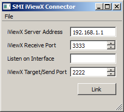

# Overview

This should support all eye trackers that are compatible with the iViewX server application by SMI (http://www.smivision.com/), although it is currently untested.

== Driver Installation ==

Before you can use this app, you need to obtain the iView X SDK from www.smivision.com (note that this program requires the "iView X SDK", not the newer "iViewNG SDK"; there is a different app for the new SDK). At the time of this writing, the download page is: http://www.smivision.com/en/gaze-and-eye-tracking-systems/support/software-download.html (alternatively you might try to google for iViewX SDK). Please make sure that your eye tracking model is supported by the SDK. Note the installation location and after you have installed the drivers, copy the contents of the bin/, include/ and lib/ folders into this folder. You should now be able to run the app!

# Usage

  * To use this app you need to set the IP addresses and ports correctly (see tool tips).

  * Make sure that your iViewX server is running, has a calibration loaded and can track gaze. Make sure that streaming of gaze packets is enabled and take note of the ports that are configured for sending and receiving data.

  * Start the iViewX app. This should give you a window like the following:
>

  * Set the correct IP address of the iViewX server application and make sure that you have the right ports assigned. The second address field should only be needed if you have multiple networks / network cards attached and you need a specific one to talk to the server.

  * To link the application to the LSL, click the "Link" button. If all goes well you should now have a new stream on the network with name "iViewX" and type "Gaze".

  * For subsequent uses you can save the desired settings from the GUI via File / Save Configuration. If the app is frequently used with different settings you might make a shortcut on the desktop that points to the app and appends to the Target field of the shortcut the snippet `-c name_of_config.cfg` to denote the name of the config file that should be loaded at startup.

This program has been reported to work with iViewX remote eye tracking devices (iViewX RED). We are not sure if the eye tracking glasses or other head-mounted trackers work with this application (we have heard of at least one user who could not seem to get them to work).
